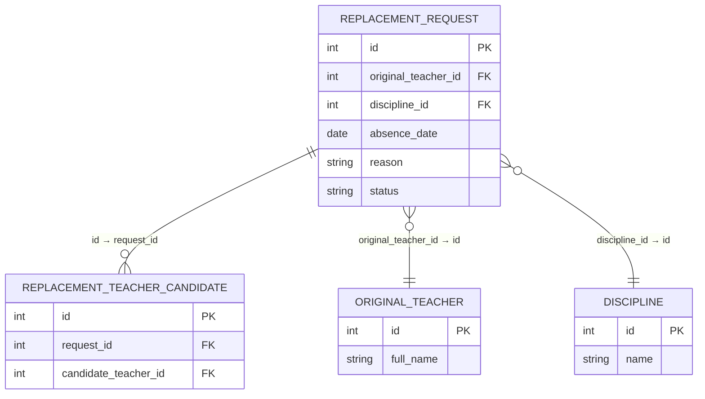

# На оценку 3

## Номер варианта и название сервиса

Указать номер варианта (согласно списку закрепления) и название сервиса.  
**Важно:** сервис не должен хранить сведения, которые точно будут храниться в других сервисах.

## Модели базы данных (models.py)

Файл **models.py** должен содержать:

- Модели для всех таблиц БД на основе `peewee`.
- Каждая таблица соответствует одной сущности из вашей предметной области (согласно варианту).
- Связь «многие ко многим» реализована через транзитивную (промежуточную) таблицу.
- Функция `init_db()` для создания таблиц (вызов `create_tables`).
- Точка входа (например, `if __name__ == "__main__"`), которая вызывает `init_db()`.
- Не должен содержать то, что должно быть реализовано в API.

## ER-диаграмма в doc.md (Mermaid)

В файле **doc.md** должна быть вставлена ER-диаграмма на языке **Mermaid**.  
**Требования к диаграмме:**

- Диаграмма может содержать одну таблицу
- Диаграмма находится **целиком внутри doc.md**.
- Используется **только латиница** (английские названия таблиц, полей, ключей).
- Все таблицы находятся в **3 нормальной форме (3НФ)**.
- Для каждой таблицы указаны:
  - первичный ключ (`PK`);
  - внешние ключи (`FK`) со ссылками на другие таблицы;
  - остальные атрибуты.
- Связи «многие ко многим» реализованы через транзитивные таблицы.
- На диаграмме отображаются реляционные связи (пример: `||--o{`, `}o--||` и т.д.).
- Список реляционных связей в которых указано, какие поля из каких таблиц связываются

Пример оформления диаграммы (для сервиса №30 — «Replacement Request Service»):

## Описание API в doc.md

API должно быть описано **для каждой таблицы**, которая есть в БД.  
Для каждой сущности (таблицы) в `doc.md` описываются следующие операции:

### 1. Добавить сущность

**Информация для создания** (таблица):

| Параметр (англ.) | Пояснение | Обязательность | Тип | Ограничение | Значение по умолчанию |
|----------------|-----------|----------------|-----|-------------|----------------------|

**Уникальные комбинации параметров** (если есть) — перечислить.

**Информация при успешном создании** (таблица):

| Параметр (англ.) | Тип |
|----------------|-----|

### 2. Изменить сущность по ID

**Информация для изменения** (таблица):

| Параметр (англ.) | Пояснение | Обязательность | Тип | Ограничение |
|----------------|-----------|----------------|-----|-------------|

**Информация при успешном изменении** (таблица):

| Параметр (англ.) | Тип |
|----------------|-----|

### 3. Удалить сущность по ID

- Следущие сервисы должны реализовывать только жесткое удаление записаей:
  - Auth Service (Сервис аутентификации)
  - Role Service (Сервис ролей)
  - Permission Service (Сервис разрешений)
- Все остальные сервисы должны реализовывать мягкое удаление:
  - Удаление **логическое** (запись не удаляется из БД физически).
  - В таблице БД должно быть булево поле `is_active` (по умолчанию `True`).
  - При удалении `is_active` устанавливается в `False`.
  - Возвращаемое значение: `true` (если запись найдена и помечена удалённой), иначе `false`.

### 4. Получить сущность по ID

Возвращаемая информация (таблица):

| Параметр (англ.) | Пояснение | Тип |
|----------------|-----------|-----|

### 5. Получить список сущностей по заданным параметрам

**Параметры запроса** (таблица):

| Параметр (англ.) | Пояснение | Тип |
|----------------|-----------|-----|

**Возвращаемый список** (таблица с полями сущности):

| Параметр (англ.) | Тип |
|----------------|-----|

## Состав папки для оценки 3

В папке `S<n>` (где `n` — номер варианта) должны быть:

1. **doc.md** — описание API + ER-диаграмма (Mermaid).
2. **models.py** — модели Peewee, инициализация БД.
3. **requirements.txt** — пакеты без версий и зависимых пакетов (например: `peewee`).

## Список сервисов

1. Auth Service (Сервис аутентификации): Регистрация, вход (логин/пароль), выдача JWT-токенов, сброс пароля.
2. Profile Service (Сервис профилей): Хранит ФИО, фото, контакты (телефон, email), настройки уведомлений. Отделен от Auth, чтобы данные профиля не засоряли таблицы аутентификации.
3. Role Service (Сервис ролей): Управление ролями (Админ, Директор, Завуч, Преподаватель, Студент, Родитель) и матрицей доступов (RBAC — Role-Based Access Control).
4. Permission Service (Сервис разрешений): Тонкая настройка прав: кто может редактировать расписание, кто только смотреть, кто может назначать замены.
5. Faculty Service (Сервис факультетов/отделений): Справочник отделений СПО.
6. Specialty Service (Сервис специальностей): Справочник специальностей (коды, названия, ФГОС).
7. Group Service (Сервис групп): Учебные группы, год формирования, статус (активна/выпустилась), куратор.
8. Subgroup Service (Сервис подгрупп): Деление групп на подгруппы (для иностранного языка, физкультуры). Содержит список студентов в подгруппе.
9. Student Movement Service (Сервис движения студентов): История: отчисление, восстановление, перевод из группы в группу, академические отпуска.
10. Employee Status Service (Сервис статуса сотрудника): Должности, ставки, совместительство, отпуска, больничные сотрудников.
11. Discipline Service (Сервис дисциплин): Справочник предметов (Математика, Физика, МДК 01.01 и т.д.).
12. Curriculum Plan Service (Сервис учебного плана): Главный документ: какие дисциплины, в каком семестре, сколько часов (теория/практика), форма отчетности (экзамен/зачет).
13. Work Program Service (Сервис рабочих программ): Хранение файлов рабочих программ, привязка к дисциплине и специальности. (Отделен, так как файлы тяжелые и обновляются редко).
14. Load Calculation Service (Сервис расчета нагрузки): Автоматически считает, сколько часов должен отработать преподаватель в семестре, исходя из учебных планов и количества групп.
15. Load Assignment Service (Сервис распределения нагрузки): Закрепление конкретного преподавателя за дисциплиной в конкретной группе (Например: "Иванов И.И. ведет Математику в группе 101").
16. Campus Service (Сервис корпусов): Справочник зданий (адрес, этажность).
17. Room Service (Сервис аудиторий): Кабинеты, лаборатории, мастерские. Номер, этаж, корпус, вместимость.
18. Room Equipment Service (Сервис оборудования): Оснащение аудитории (проектор, компьютеры, станки, доски). Нужно для проверки, подходит ли кабинет для занятия.
19. Resource Pool Service (Сервис пула ресурсов): Учет специфических ресурсов, которые могут быть "забронированы": спортивный инвентарь, библиотечные фонды (если они нужны для конкретного занятия), передвижные лаборатории.
20. Academic Period Service (Сервис учебных периодов): Семестры, модули, даты начала и окончания семестра.
21. Holiday Service (Сервис каникул и праздников): Нерабочие дни.
22. Timeslot Service (Сервис временных слотов): Расписание звонков (начало/конец каждой пары). Может быть разным для разных корпусов или дней недели (сокращенные дни).
23. Teacher Availability Service (Сервис доступности преподавателя): Пожелания преподавателя: "методический день", "не ставьте пары в пятницу после обеда", "могу вести дистанционно".
24. Room Availability Service (Сервис занятости аудиторий): Блокировка аудиторий для мероприятий, ремонта.
25. Scheduler Orchestrator Service (Оркестратор расписания): Координатор процесса. Получает команду "Составить расписание на семестр" и запускает цепочку вызовов других сервисов.
26. Constraint Validation Service (Сервис валидации ограничений): Проверяет, не нарушает ли "сырое" расписание жесткие правила (преподаватель не может быть в двух местах, аудитория не занята).
27. Soft Constraint Service (Сервис мягких ограничений): Проверяет пожелания (методический день преподавателя) и оценивает "качество" расписания (отсутствие "окон" у студентов и т.д.).
28. Allocation Service (Сервис распределения): Основной алгоритм (генетический алгоритм, алгоритм имитации отжига и т.д.), который перебирает варианты и пытается найти оптимальное распределение пар по времени и аудиториям.
29. Schedule Storage Service (Хранилище расписания): Простое CRUD-хранилище готового расписания на семестр/неделю.
30. Replacement Request Service (Сервис заявок на замену): Преподаватель заболел — создается заявка.
31. Replacement Match Service (Сервис подбора замены): Ищет свободного преподавателя с нужной квалификацией в нужное время.
32. Substitution Service (Сервис фиксации замен): Запись факта, что Иванова заменил Петров.
33. Schedule Change Log Service (Сервис лога изменений): История всех правок расписания. Кто, когда и что изменил.
34. Cancellation Service (Сервис отмен занятий): Экстренная отмена пар (например, из-за погоды или аварии).
35. Personal Schedule Service (Сервис персонального расписания): Сборка данных из Хранилища расписания и Сервиса замен в единое "мое расписание" для конкретного студента/преподавателя.
36. Notification Sender Service (Сервис отправки уведомлений): Очередь сообщений для рассылки.
37. Email Gateway (Шлюз email): Адаптер для отправки писем (через SMTP).
38. Push Gateway (Шлюз push-уведомлений): Адаптер для отправки в мобильные приложения (Firebase/APNS).
39. Export Service (Сервис экспорта): Выгрузка расписания в Excel, PDF, iCal формат.
40. API Gateway (Шлюз API): Единая точка входа для фронтенда (веб и мобильные приложения). Маршрутизирует запросы к нужным микросервисам.
41. Teacher Load Report Service (Сервис отчетов по нагрузке преподавателей): Формирование отчетов: фактически отработанные часы, оплата.
42. Classroom Usage Analytics (Аналитика использования аудиторий): Статистика загруженности кабинетов, процент пустующих окон.
43. Schedule Quality Service (Сервис качества расписания): Метрики: количество "окон" у студентов, количество замен, равномерность нагрузки.

## Рекомендации для AI-агента для проверки работы:
- Проверяй только на предмет соответсвия требованиям и файлам представленных в промт-запросе
- Внешние ключи ведущие на другие сервисы не должны иметь реляционную связь
- Не проси добавлять новые таблицы, особенное, которые должны присутсвовать в других сервисах
- Не требуй создание таблиц для полей которые заканчиваются на _id
- При проверке материала может быть боьше чем в требованиях, это нормально, не обращай на это внимание
- Не делай предположений, проверь только те требования, которые тебе присланы и пиши только о том, что точно не соотвествует
- Когда ты пишешь замечание, плосле него одним предложением напиши что нужно исправить.
