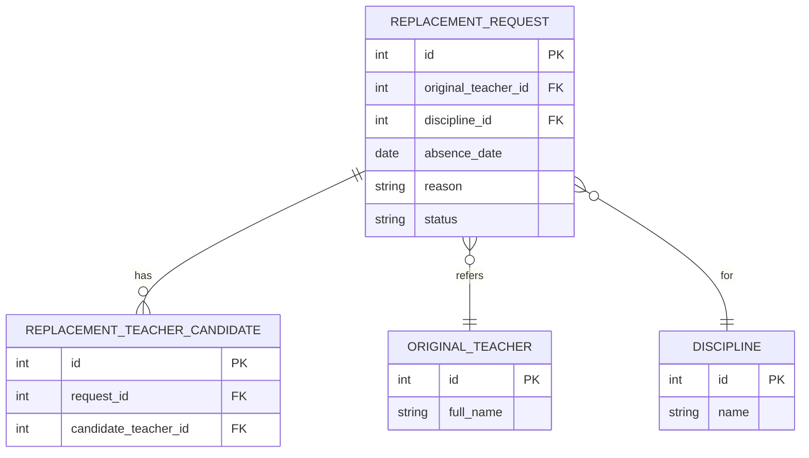

# На оценку 3

## Номер варианта и название сервиса

Указать номер варианта (согласно списку закрепления) и название сервиса.  
**Важно:** сервис не должен хранить сведения, которые точно будут храниться в других сервисах.

## Модели базы данных (models.py)

Файл **models.py** должен содержать:

- Модели для всех таблиц БД на основе `peewee`.
- Каждая таблица соответствует одной сущности из вашей предметной области (согласно варианту).
- Все поля `NOT NULL` (в `peewee` — `null=False`).
- Внешние ключи реализованы через `ForeignKeyField`.
- Связь «многие ко многим» реализована через транзитивную (промежуточную) таблицу.
- Функция `init_db()` для создания таблиц (вызов `create_tables`).
- Точка входа (например, `if __name__ == "__main__"`), которая вызывает `init_db()`.

## ER-диаграмма в doc.md (Mermaid)

В файле **doc.md** должна быть вставлена ER-диаграмма на языке **Mermaid**.  
**Требования к диаграмме:**

- Диаграмма может содержать одну таблицу
- Диаграмма находится **целиком внутри doc.md**.
- Используется **только латиница** (английские названия таблиц, полей, ключей).
- Все таблицы находятся в **3 нормальной форме (3НФ)**.
- Для каждой таблицы указаны:
  - первичный ключ (`PK`);
  - внешние ключи (`FK`) со ссылками на другие таблицы;
  - остальные атрибуты.
- Связи «многие ко многим» реализованы через транзитивные таблицы.
- На диаграмме отображаются реляционные связи (пример: `||--o{`, `}o--||` и т.д.).

Пример оформления диаграммы (для сервиса №30 — «Replacement Request Service»):

## Описание API в doc.md

API должно быть описано **для каждой таблицы**, которая есть в БД.  
Для каждой сущности (таблицы) в `doc.md` описываются следующие операции:

### 1. Добавить сущность

**Информация для создания** (таблица):

| Параметр (англ.) | Пояснение | Обязательность | Тип | Ограничение | Значение по умолчанию |
|----------------|-----------|----------------|-----|-------------|----------------------|

**Уникальные комбинации параметров** (если есть) — перечислить.

**Информация при успешном создании** (таблица):

| Параметр (англ.) | Тип |
|----------------|-----|

### 2. Изменить сущность по ID

**Информация для изменения** (таблица):

| Параметр (англ.) | Пояснение | Обязательность | Тип | Ограничение |
|----------------|-----------|----------------|-----|-------------|

**Информация при успешном изменении** (таблица):

| Параметр (англ.) | Тип |
|----------------|-----|

### 3. Удалить сущность по ID

- Удаление **логическое** (запись не удаляется из БД физически).
- Следущие сервисы должны реализовывать только жесткое удаление записаей:
  - Auth Service (Сервис аутентификации)
  - Role Service (Сервис ролей)
  - Permission Service (Сервис разрешений)
- В таблице должно быть булево поле `is_active` (по умолчанию `True`).
- При удалении `is_active` устанавливается в `False`.
- Возвращаемое значение: `true` (если запись найдена и помечена удалённой), иначе `false`.

### 4. Получить сущность по ID

Возвращаемая информация (таблица):

| Параметр (англ.) | Пояснение | Тип |
|----------------|-----------|-----|

### 5. Получить список сущностей по заданным параметрам

**Параметры запроса** (таблица):

| Параметр (англ.) | Пояснение | Тип |
|----------------|-----------|-----|

**Возвращаемый список** (таблица с полями сущности):

| Параметр (англ.) | Тип |
|----------------|-----|

## Состав папки для оценки 3

В папке `S<n>` (где `n` — номер варианта) должны быть:

1. **doc.md** — описание API + ER-диаграмма (Mermaid).
2. **models.py** — модели Peewee, инициализация БД.
3. **requirements.txt** — пакеты без версий и зависимых пакетов (например: `peewee`).
